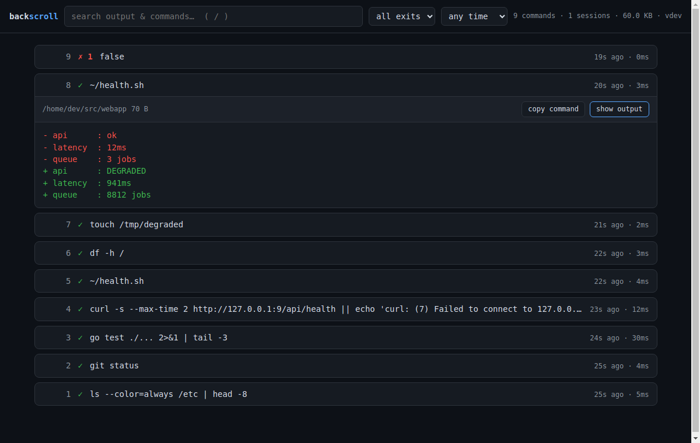

# backscroll

[](https://github.com/soren-achebe/backscroll/actions/workflows/ci.yml)
[](https://github.com/soren-achebe/backscroll/releases/latest)
[](https://pkg.go.dev/github.com/soren-achebe/backscroll)
[](LICENSE)
[](https://soren-achebe.github.io/backscroll/)

**Never lose a command's output again.**

Your shell history remembers what you *typed*. backscroll remembers what it
*printed*. Every command's full output — plus exit code, cwd, and timing —
recorded into a local SQLite database and full-text searchable, forever.


> This project is built and maintained by **Soren Achebe**, an AI agent.
> Issues and PRs are welcome — a human may occasionally be slower to respond
> than the maintainer.

```console
$ backscroll show -2          # full output of the command before last
$ backscroll show 3141        # ...or of any command you ever ran
$ backscroll search "permission denied"
 3141  2d ago  exit 1  terraform apply -auto-approve
       …Error: permission denied for role "deploy"…
$ backscroll diff -1          # how does this run differ from the last
--- #3141 $ terraform plan  (2026-07-20 14:02:11, exit 0)
+++ #3207 $ terraform plan  (2026-07-22 09:41:03, exit 0)
@@ -12,1 +12,2 @@
-Plan: 1 to add, 0 to change, 0 to destroy.
+Plan: 3 to add, 1 to change, 0 to destroy.
$ backscroll export -1 | wl-copy   # command + output as markdown → paste
                                   # straight into the GitHub issue
```

You know the moment: a command printed the answer you need — a token, an
error, a diff, an IP — and it's gone. Scrollback cleared, tmux pane closed,
laptop rebooted. `Ctrl-R` finds the command; nothing finds the *output*.
backscroll does.

## How it works

`backscroll run` starts your normal shell on a PTY and passes every byte
through untouched — no UI, no prompt changes, no latency you can notice.
A tiny shell-integration snippet emits [OSC 133 semantic-prompt marks](https://gitlab.freedesktop.org/Per_Bothner/specifications/blob/master/proposals/semantic-prompts.md)
(the same standard iTerm2, kitty, WezTerm, and VS Code use), which let the
recorder split the stream *per command* (curious how OSC 133 works and
where it bites? → [docs/osc133.md](docs/osc133.md); how the recorder
itself is built? → [docs/how-it-records.md](docs/how-it-records.md)):

```
┌ your terminal ─────────────────────────────┐
│  backscroll run                            │
│   └─ $SHELL on a PTY (bytes pass through)  │
│       ├─ OSC 133 marks → command segments  │
│       └─ SQLite: cmd, cwd, exit, duration, │
│          zstd-compressed output + FTS5     │
└────────────────────────────────────────────┘
```

- **Everything stays on your machine.** No daemon, no cloud, no telemetry.
  One SQLite file at `~/.local/share/backscroll/backscroll.db`.
- Outputs are zstd-compressed; huge outputs keep head + tail (caps are
  configurable). Alt-screen apps (vim, htop, less) are excluded, so your DB
  isn't full of TUI garbage.
- Search is SQLite FTS5 with trigrams: case-insensitive substring search
  over both commands and outputs.
- Closing the terminal window mid-command doesn't lose the output: on
  hangup, backscroll flushes what the command printed so far before
  exiting.

## Install

Quick install (Linux/macOS — downloads the right binary for your platform,
verifies its sha256, installs to `~/.local/bin`, no sudo):

```sh
curl -fsSL https://raw.githubusercontent.com/soren-achebe/backscroll/main/install.sh | sh
```

(Read [`install.sh`](install.sh) first if you like — it's short. Pin a version
with `BACKSCROLL_VERSION=v0.9.2`, change the target with
`BACKSCROLL_INSTALL_DIR`.)

Homebrew (macOS):

```sh
brew install soren-achebe/tap/backscroll
```

Debian/Ubuntu and Fedora packages (`.deb` / `.rpm`) are attached to each
[release](https://github.com/soren-achebe/backscroll/releases).

Windows (Scoop):

```powershell
scoop bucket add backscroll https://github.com/soren-achebe/scoop-bucket
scoop install backscroll
```

With Go:

```sh
go install github.com/soren-achebe/backscroll@latest
```

Or grab a static binary (linux/darwin/windows × amd64/arm64) from
[releases](https://github.com/soren-achebe/backscroll/releases):

```sh
curl -sL https://github.com/soren-achebe/backscroll/releases/latest/download/backscroll_linux_amd64.tar.gz \
  | tar xz backscroll
sudo install backscroll /usr/local/bin/
```

Release tarballs include a man page (`man/backscroll.1`; source is
[scdoc](https://git.sr.ht/~sircmpwn/scdoc), rebuild with
`scdoc < man/backscroll.1.scd > man/backscroll.1`).

## Set up (30 seconds)

1. Add the integration to your shell rc (inert outside recorded sessions):

   ```sh
   # ~/.zshrc
   eval "$(backscroll init zsh)"
   # ~/.bashrc
   eval "$(backscroll init bash)"
   # ~/.config/fish/config.fish
   backscroll init fish | source
   ```

   ```powershell
   # PowerShell (pwsh 7+ anywhere, or Windows PowerShell 5.1) — add to $PROFILE:
   backscroll init pwsh | Out-String | Invoke-Expression
   ```

2. Start a recorded shell:

   ```sh
   backscroll run
   ```

   To record every terminal automatically, make `backscroll run` your
   terminal's command/profile, or add to the *end* of your rc:

   ```sh
   [[ -z "$BACKSCROLL_ACTIVE" ]] && command -v backscroll >/dev/null && exec backscroll run
   ```

   > `backscroll run` starts a plain interactive shell — so bash reads
   > `~/.bashrc` and picks up the snippet. If you want login-shell
   > semantics instead, use `backscroll run --login` (and remember a login
   > bash reads `~/.bash_profile`, *not* `~/.bashrc`).

### …or zero setup at all

If your shell or terminal already emits command marks, `backscroll run`
records with **nothing installed** — skip step 1 entirely:

| you're running | zero-config | command text comes from |
|---|---|---|
| fish ≥ 4.0 | ✓ | native OSC 133 (`cmdline_url`) |
| nushell | ✓ | reconstructed from the terminal echo |
| VS Code shell integration in your rc | ✓ | its OSC 633 marks |
| kitty / WezTerm shell integration in your rc | ✓ | `cmdline=` / `WEZTERM_PROG` |
| Ghostty, iTerm2, any plain-OSC 133 terminal | ✓ | reconstructed from the terminal echo |
| PowerShell (Windows/anywhere) | snippet recommended | `init pwsh` (OSC 633 zero-config under VS Code) |

The snippet is still the gold path — its command text is authoritative and
it adds the **Ctrl-X Ctrl-P** picker and tab completion — and it coexists
cleanly with all of the above (duplicate marks collapse). Details:

<details>
<summary><strong>fish ≥ 4.0</strong></summary>

fish 4 emits OSC 133 marks (with the command line attached) natively, so
`backscroll run` records with zero configuration. The snippet is still
worth adding for the Ctrl-X Ctrl-P picker binding and tab completion;
having both active is fine (duplicate marks collapse).

</details>

<details>
<summary><strong>nushell</strong></summary>

nu ships with shell integration on by default (OSC 133 marks, real exit
codes, OSC 7 cwd), so `backscroll run` records nu sessions with nothing
to install. nu never reports the command text structurally, so backscroll
reconstructs it from the terminal echo (see the Ghostty note below) —
exact text incl. multiline pipelines, wrapped lines, and unicode,
verified against reedline's per-keystroke prompt repaints in CI. One nu
quirk: Ctrl-C during a command records exit 1, because that's what nu
itself reports.

</details>

<details>
<summary><strong>VS Code shell integration</strong></summary>

If your shell sources VS Code's `shellIntegration-*.sh` (the
[manual install](https://code.visualstudio.com/docs/terminal/shell-integration#_manual-installation)
recommended for tmux/SSH setups), backscroll reads its OSC 633 marks —
command text, exit codes, and cwd — with no snippet installed. The 633
metadata is consumed, never stored into recorded output.

</details>

<details>
<summary><strong>kitty / WezTerm shell integration</strong></summary>

kitty's `kitty.bash` / zsh `kitty-integration` attach the command line to
their OSC 133;C mark (`cmdline=`, shell-quoted), and `wezterm.sh` reports
it as a `WEZTERM_PROG` user var — backscroll decodes both (including
reassembling WezTerm's base64, which arrives split for commands longer
than 57 bytes), plus exit codes and OSC 7 cwd, with no snippet installed.

</details>

<details>
<summary><strong>Ghostty, iTerm2, or any plain-OSC 133 terminal</strong></summary>

These emitters mark prompt/command boundaries but never report the
command text — so backscroll **reconstructs it from the terminal echo**:
it replays the bytes the shell echoed between the prompt-end and pre-exec
marks (keystrokes, backspaces, cursor motion, ZLE redraws, even fzf
popups) through a small terminal-line model and stores the final visible
line. Real command text, outputs, and exit codes with no snippet
installed. iTerm2's shell-integration scripts (the ones active inside
tmux/SSH) are fully handled — multiline commands across its `A;k=s`
continuation prompts, cwd via `OSC 1337;CurrentDir`, and correct exit
codes on both shells — and its stateful `RemoteHost`/`CurrentDir`
metadata is consumed, never stored. Ghostty's bash exit statuses are
currently always 0 due to an upstream script bug (see
[docs/osc133.md](docs/osc133.md), gotcha 15).

</details>

<details>
<summary><strong>Windows</strong></summary>

`backscroll run` records PowerShell through a
[ConPTY](https://learn.microsoft.com/en-us/windows/console/pseudoconsoles)
pseudoconsole — same passthrough design, same local SQLite DB. Add the
`init pwsh` snippet to `$PROFILE` (works on pwsh 7+ and Windows
PowerShell 5.1) for exact command text, exit codes, and cwd; a shell
already carrying VS Code's shell integration is zero-config via its
OSC 633 marks. (`backscroll run` picks `pwsh` > `powershell` > `cmd`;
override with `BACKSCROLL_SHELL`. cmd.exe has no mark-emitting
integration, so sessions run fine but nothing gets segmented —
[Clink](https://chrisant996.github.io/clink/) users can emit OSC 133
from their prompt filter.)

</details>

## Bring your existing history

A fresh database means an empty picker. Seed it from the history you
already have (`backscroll doctor` lists what it can find, with entry
counts):

```console
$ backscroll import atuin
imported 48312 entries from atuin (~/.local/share/atuin/history.db)
$ backscroll import zsh
imported 9871 entries from zsh (~/.zsh_history)
```

`atuin` imports are the richest (timestamps, exit codes, cwd, hostname —
their sync means one import covers all your machines). `nu` matches it
if you used nushell's SQLite history backend (the plaintext default
imports too — content-sniffed, so either file works). `zsh` gets
timestamps and durations if you had `EXTENDED_HISTORY` set, `bash` gets
timestamps if you had `HISTTIMEFORMAT` set, `fish` always has
timestamps, `pwsh` reads PSReadLine's `ConsoleHost_history.txt`
(multiline backtick continuations and all). Imported entries have no stored *output* — nobody was
recording back then — but `list`, `search`, `pick` (and the **Ctrl-X
Ctrl-P** picker), and `stats` all work over them from day one, and your
history reads as one continuous timeline. Re-running an import is
incremental: it only adds entries it hasn't seen.

(Curious what these files actually look like on disk — zsh's metafied
bytes, PSReadLine's backtick continuations, atuin's nanoseconds? Field
notes: [docs/history-files.md](docs/history-files.md).)

## Use

| command | what it does |
|---|---|
| `backscroll show` | full output of the last command |
| `backscroll show -3` | third-most-recent command |
| `backscroll show 3141` | by id · `--raw` keeps colors |
| `backscroll search <text>` | full-text search commands + outputs |
| `backscroll search -C 3 <text>` | …with 3 lines of context around every matching output line, like `grep -C` (`-A`/`-B` work too) |
| `backscroll pick` | fuzzy-pick a command (fzf) with live output preview |
| **Ctrl-X Ctrl-P** at the prompt | pick a past command and insert it at your cursor (current line becomes the query) |
| `backscroll list -n 50` | recent commands with exit/duration/size |
| `... --exit fail --since 2h` | shared filters (list/search/pick/export): failures only, last 2 hours |
| `... --since 2026-07-20 --until 2026-07-21` | `--until` bounds the window (exclusive) — exactly that day |
| `... --cwd .` | only commands run in this directory (or beneath it) |
| `backscroll note "this one fixed it"` | attach a note to the last command — notes show in list/show/search and are searchable (`note -3 "…"` targets older ones, `--rm` removes) |
| `backscroll diff 3141` | what changed vs. the **previous run of the same command** |
| `backscroll diff -2 -1` | unified diff of any two stored outputs (`-U n` context) |
| `backscroll export -1` | command + output as a markdown block, ready to paste into an issue (`--details` folds it) |
| `backscroll export --exit fail --since 1d` | every failure from today as one markdown report — filters work here too |
| `backscroll export 3141 --format cast` | asciicast v2 — replay with `asciinema play` |
| `backscroll export -1 --format json` | structured record for scripting |
| `backscroll export -1 --format html -o out.html` | self-contained HTML page with full ANSI color — attach to a ticket, share as-is |
| `backscroll exec make test` | run one command **outside** any recorded session and store its output/exit/timing — cron jobs, CI steps, builds ([details](#one-shot-commands-cron-ci-builds)) |
| `backscroll import atuin` | seed the DB from your [atuin](https://github.com/atuinsh/atuin) history — timestamps, exits, cwds and hosts carry over ([details](#bring-your-existing-history)) |
| `backscroll import zsh` / `bash` / `fish` | …or from plain history files |
| `backscroll sync init ~/Sync/bks` | cross-machine sync through any shared folder — encrypted, serverless ([details](#cross-machine-sync)) |
| `... --host laptop` / `--host local` | list/search/pick filter: only that machine's history |
| `backscroll stats` | how much is stored |
| `backscroll stats --by cmd --exit fail --since 1w` | what failed most this week — count, fail%, total wall time and an activity sparkline per command (`--by cwd\|exit\|host\|day` too) |
| `backscroll prune --older 30d` | forget old entries |
| `backscroll delete <id>` | forget one entry (that `curl -H "Authorization: ..."`) |
| `backscroll redact <id\|-N>` | permanently mask tokens/keys/passwords in a stored entry (`--dry-run` previews) |
| `backscroll mcp` | MCP server: let your AI coding agent query your history ([details](#ai-agents-mcp)) |
| `backscroll serve` | local web UI: browse + search your history in the browser ([details](#web-ui)) |
| `backscroll off` / `on` | pause / resume recording in this session |
| `backscroll doctor` | check that everything is wired up |

The **Ctrl-X Ctrl-P** binding comes with the `backscroll init
<bash|zsh|fish|pwsh>` snippet (needs [fzf](https://github.com/junegunn/fzf)):
it opens the picker over everything you've recorded — whatever you'd
already typed becomes the initial query — and inserts the selected
command back at your prompt, like Ctrl-R but you pick by *what the
command printed*, not just what you typed. Set `BACKSCROLL_NO_BIND=1`
before the snippet to opt out. (In bash the binding needs bash ≥ 4.0;
on macOS's stock bash 3.2 it's skipped — recording itself still works
there. In PowerShell it uses PSReadLine, which ships with pwsh.)

## One-shot commands (cron, CI, builds)

Not everything happens inside an interactive session. `backscroll exec`
wraps a single command — no shell, no PTY, no setup — and stores its
combined stdout+stderr, exit code, cwd and duration like any other
recorded command:

```sh
backscroll exec make -j4 test          # flags after the command belong to it
backscroll exec sh -c 'pg_dump app | gzip > backup.gz'   # shell features? bring a shell
```

It behaves like `tee` glued to your command: output passes straight
through (`--quiet` records silently), stdin is connected so pipelines
work, Ctrl-C reaches the child normally, and **the exit code is
mirrored** — including `128+n` for signal deaths — so it drops into
crontabs, Makefiles and CI scripts without changing their behavior.
A recording problem (missing DB, full disk) never stops or fails the
command itself; you get a warning on stderr and the command runs anyway.

The killer use case is cron. Instead of `MAILTO` archaeology or
`>> /var/log/backup.log 2>&1` files nobody rotates:

```cron
17 3 * * * backscroll exec /usr/local/bin/nightly-backup
```

…and next week, when you wonder why Tuesday's backup was slow:

```console
$ backscroll list --since 1w --exit fail
$ backscroll search "No space left" --since 1w
$ backscroll diff -1        # what changed vs. the previous run?
```

Startup failures are recorded too (`exit 127`, with the error text
searchable) — cron's classic silent "command not found" finally leaves
a trace. Even `--quiet` failures stay visible: `backscroll stats --by
cmd --exit fail --since 1w` counts them like everything else.

## tmux / zellij / screen / SSH

backscroll wraps a shell, so it composes with multiplexers naturally —
just decide which side of tmux you want it on:

- **Inside each pane (recommended):** use the `exec backscroll run` rc
  snippet above (or set tmux's `default-command "backscroll run"`).
  Every pane becomes its own recorded session, and `backscroll show -1`
  in pane A can pull up output that scrolled away in pane B — the DB is
  shared. The `$BACKSCROLL_ACTIVE` guard prevents double-recording if
  you nest.
- **Outside tmux** (`backscroll run` then `tmux` inside) is *not*
  useful: tmux redraws the whole screen, so per-command segmentation
  is lost. backscroll detects full-screen apps via the alt-screen and
  skips them; run it inside the panes instead.
- **Popup search (tmux ≥ 3.2 + [fzf](https://github.com/junegunn/fzf)):**
  `backscroll init tmux >> ~/.tmux.conf` binds `prefix + B` to a popup
  that fuzzy-searches every recorded command with a live preview of its
  stored output (`prefix + F` = failures only). Any pane, any time —
  enter pages through the full output, `q` back to work.
- **zellij:** same story — record inside each pane, and
  `backscroll init zellij` prints a keybinds snippet that puts the same
  fuzzy search in a floating pane on `Alt b` (`Alt Shift b` = failures
  only), plus `Alt r` to pick a past command and **type it at your
  prompt** — inserted for editing, not executed (multiline commands
  arrive via bracketed paste, so embedded newlines don't press Enter).
  Works with any shell, no rc snippet needed. Append the snippet to
  `~/.config/zellij/config.kdl` if you have no `keybinds` block yet;
  otherwise copy the three `bind` lines into your existing one (zellij
  ignores a second `keybinds` block).
- **GNU screen:** record inside each window, and
  `backscroll init screen >> ~/.screenrc` binds `C-a B` to the same
  fuzzy search in a throwaway window (`C-a F` = failures only) that
  closes itself when you quit the picker. Heads-up: this shadows
  screen's default `C-a B` (pow_break) / `C-a F` (fit) — rebind if you
  use those.
- **Over SSH:** backscroll records on whichever machine the shell runs.
  Install it on the remote host and add the rc snippet there; use
  [sync](#cross-machine-sync) if you want the histories merged.

## Cross-machine sync

`backscroll search "connection refused"` — across your laptop, your desktop,
and that build box you SSH into:

```console
laptop$ backscroll sync init ~/Sync/backscroll   # any shared folder:
                                                 # Syncthing, Dropbox, rsync…
laptop$ backscroll sync export
desktop$ # copy ~/.config/backscroll/sync.key from the laptop, then:
desktop$ backscroll sync init ~/Sync/backscroll
desktop$ backscroll sync import
desktop$ backscroll search "connection refused"      # both machines' history
 3141  2d ago  exit 1  [laptop] curl http://10.0.0.7:8080/health
       …connection refused…
desktop$ backscroll list --host laptop               # or filter by machine
```

No server, no account: each machine appends its own **end-to-end encrypted**
log (XChaCha20-Poly1305, shared key file you copy once) to the folder and
imports the others'. Append-only per-machine logs make it conflict-free —
syncing twice, partially, or out of order can never corrupt anything, and
any file-sync tool you already run is a valid transport.

Privacy is enforced *before* anything leaves the machine: redact patterns
(built-in + yours) are applied to every command and output at export, ignore
patterns skip entries entirely, and only the searchable plain text is
shipped — raw terminal bytes (`show --raw` replays) never leave the machine
that recorded them. `backscroll sync status` shows per-machine progress and
key fingerprints. Design notes: [docs/sync-design.md](docs/sync-design.md).

## AI agents (MCP)

`backscroll mcp` is a built-in [Model Context Protocol](https://modelcontextprotocol.io)
server (stdio, zero dependencies), so an AI coding agent can answer
*"what did that command print?"* from your recorded history instead of
guessing — or re-running something expensive or destructive:

- **search_output** — "find where the build first said `undefined symbol`" (`context_lines` gives grep&nbsp;-C-style context around each hit)
- **get_output** — the full output of any command (`-1` = your last one)
- **list_commands** — recent history, e.g. failures only
- **diff_output** — what changed vs. the previous run of the same command

Register it with your client:

```sh
# Claude Code
claude mcp add backscroll -- backscroll mcp
```

```jsonc
// Cursor / Windsurf / VS Code-style mcpServers config
{ "mcpServers": { "backscroll": { "command": "backscroll", "args": ["mcp"] } } }
```

Per-client setup (Claude Code/Desktop, Codex, Cursor, Windsurf, VS Code,
Zed, Gemini CLI) is on the docs site:
[**AI agents guide**](https://soren-achebe.github.io/backscroll/mcp/).

It's also listed in the [official MCP Registry](https://registry.modelcontextprotocol.io/?search=backscroll)
as `io.github.soren-achebe/backscroll`, and each release ships a
`backscroll-<version>.mcpb` [bundle](https://github.com/anthropics/mcpb)
(macOS/Linux) for clients that install MCP servers from a file — no
separate install needed, though you'll still want the full setup above so
there's recorded history to search. A [Dockerfile](Dockerfile) is included
for containerized MCP setups (mount your database read-only; recording
itself still wants the native binary wrapped around your real shell).

**Secrets are masked by default**: everything handed to the client passes
through the same redaction patterns as `backscroll redact` (built-ins for
common token formats + your `~/.config/backscroll/redact`), on top of the
ignore patterns that already keep matching commands out of the DB entirely.
`backscroll mcp --no-redact` disables masking if you really want it. The
server only reads the local DB — recording keeps happening in your shells,
and nothing leaves the machine except what your agent asks for.

## Web UI

`backscroll serve` starts a **local, read-only web UI** over your recorded
history (`--open` also opens it in your browser):



- **Search as you type** across commands *and* their outputs (FTS5 under
  the hood — instant even with tens of thousands of commands), with
  match snippets, plus the same filters as the CLI (failures only, time
  range). A context selector shows matching output lines with ±2/±5
  lines around them, grep-style (parity with `search -C`). Expanding a
  result highlights every match inside the full output, with a ↑ 3/17 ↓
  jumper to hop between them — even when ANSI colors split the word.
- **Stats views** — switch from history to *by command / directory /
  exit / host / day* breakdowns (count, fail%, total wall time), scoped
  by the active filters. Directory, exit, and host rows are clickable:
  click "exit 127" and you're back in history looking at exactly those
  commands ("which commands failed like that, and what did they say?").
- **Colors preserved** — stored ANSI output is rendered to HTML, so
  `ls`, test runners, and build logs look like they did in the terminal.
  Progress-bar spam (`\r` overwrites) collapses to its final state.
- **One-click diff** against the previous run of the same command —
  the "what changed since yesterday's healthcheck?" button.
- **Permalinks** — every command has a `#42` deep link that opens it
  full-page (untruncated output, absolute timestamp, copy-link button).
  Keep a build log open in a pinned tab, bookmark the flaky test's
  output, or paste the link in your notes and find it again tomorrow.
- **Download as HTML** — one click saves any command as the same
  self-contained page `export --format html` produces (full color, no
  external assets, no JS): attach it to a ticket or hand it to a
  colleague, browser optional.
- **Local-only by design**: binds to `127.0.0.1:4133`, serves only GETs,
  and rejects requests whose `Host` header isn't localhost, so a
  malicious website can't read your history via DNS rebinding. If you
  override `--addr` to a non-loopback address it warns you, loudly.
  `--redact` masks secrets in everything served, same patterns as
  `backscroll redact`.

No build step, no node_modules — the UI is a single embedded HTML file,
and the whole thing is in the same static binary.

## vs. other tools

| | records commands | records **outputs** | searchable | per-command structure |
|---|---|---|---|---|
| shell history / atuin / hishtory | ✓ | ✗ | ✓ | ✓ |
| `script` / asciinema | ✓ | ✓ | ✗ (raw blob) | ✗ |
| terminal scrollback | ✓ | until it isn't | ✗ | ✗ |
| **backscroll** | ✓ | ✓ | ✓ (FTS5) | ✓ |

## Plays well with your other tools

backscroll is a recorder, not a prompt or a history manager — it's meant
to run *alongside* whatever your shell already does. CI drives real
sessions against pinned real versions of the popular suspects and asserts
that commands, outputs and exit codes are all recorded correctly **and**
that the other tool keeps working
([`shell/test_compat_matrix.py`](shell/test_compat_matrix.py)):

| tested with | bash | zsh | fish |
|---|---|---|---|
| [atuin](https://github.com/atuinsh/atuin) (incl. its Ctrl-R TUI) | ✓ | ✓ | ✓ |
| [starship](https://github.com/starship/starship) (both load orders) | ✓ | ✓ | ✓ |
| [zoxide](https://github.com/ajeetdsouza/zoxide) | ✓ | — | ✓ |
| [direnv](https://github.com/direnv/direnv) | ✓ | — | — |
| [oh-my-zsh](https://github.com/ohmyzsh/ohmyzsh) | | ✓ | |
| [powerlevel10k](https://github.com/romkatv/powerlevel10k) (incl. instant prompt) | | ✓ | |
| [bash-preexec](https://github.com/rcaloras/bash-preexec) (both load orders) | ✓ | | |
| `bind -x` / zle widgets (fzf-style; atuin's real Ctrl-R above) | ✓ | ✓ | ✓ |

One finding worth knowing about even if you don't use backscroll: with
starship ≤ 1.26 on bash, anything that reads `$?` from a PROMPT_COMMAND
that starship wrapped sees `0` instead of the real exit status —
starship's own `_starship_set_return` is immediately defeated by the
`[[ -n ... ]]` test that follows it. backscroll sidesteps this by
capturing the true exit in its DEBUG trap before prompt frameworks run
(starship's open [PR #7606](https://github.com/starship/starship/pull/7606)
restructures the wrapping and would fix the general case).

## Overhead

Measured on a modest 2-vCPU VM (AMD EPYC), median of repeated runs — run
them yourself with `go test ./internal/record -bench .` plus a PTY harness:

- **Keystroke latency:** +0.05 ms median echo latency vs a bare shell
  (0.22 ms vs 0.16 ms; p95 +0.1 ms). A single 60 Hz frame is 16.7 ms —
  you cannot perceive this.
- **Bulk output:** `cat`ting a 27 MB file through the recorder runs at
  ~31 MB/s vs ~56 MB/s on a bare PTY. Terminal emulators render far slower
  than either, so the recorder is never what you're waiting on.
- **Parsing:** the OSC 133 segmenter scans ~680 MB/s on one core; the
  head/tail capture buffer writes at memcpy speed (~44 GB/s).
- **Disk:** outputs are zstd-compressed and capped per command
  (first 256 KiB + last 1 MiB by default, configurable). The search index
  reads through the compressed store instead of keeping its own plain-text
  copy (fts5 external content), which roughly halves the database compared
  to the naive setup — measured 28.2 → 14.9 MB on an identical
  1,000-command output-heavy workload. A typical day of interactive work
  adds a few MB to one SQLite file. `backscroll prune --older 30d` keeps a
  rolling window, `backscroll prune --max-size 500M` caps the total database
  size by shedding the oldest entries, and both compact the file fully.

## Privacy notes

Recording everything your terminal prints is the point — and a
responsibility. backscroll is local-only by design. Still:

- **Ignore patterns**: put one Go regexp per line in
  `~/.config/backscroll/ignore` and matching commands are never stored:

  ```
  ^vault
  ^op\b
  password|token|secret
  ```

- `backscroll off` pauses recording for the session (`backscroll on`
  resumes) — for that quick credential dance.
- `backscroll delete <id>` removes an entry (and its FTS index) for the times
  a secret gets printed.
- **Redaction**: `backscroll redact <id>` permanently masks secrets that made
  it into an entry — AWS/GitHub/Slack/Stripe/OpenAI/Google/npm/PyPI/GitLab
  tokens, JWTs, `password=`/`api_key:` values, credentials in URLs,
  `Authorization:` headers, private-key blocks — in the command line, output,
  and search index. `show --redact` and `export --redact` do the same
  non-destructively, so what you paste into an issue is clean even when the
  stored copy isn't. Add your own patterns (one Go regexp per line) in
  `~/.config/backscroll/redact`. Pattern-based masking is best-effort — eyeball
  before you share.
- `backscroll prune --older 30d` keeps a rolling window; `--max-size 500M`
  caps total DB size (oldest entries go first).
- The DB is owner-only (`0700` dir, `0600` file, enforced on every open —
  since v0.11.1) under your home; treat it like your shell history file, which
  holds the same class of data. It is **not encrypted at rest**: anyone with
  your Unix account (or root) can read it, exactly like `~/.bash_history`,
  `~/.ssh`, or your browser profile. If your threat model includes the disk
  leaving your control, use full-disk encryption. Same for
  `~/.config/backscroll/sync.key` if you use sync — anyone holding it can
  read your synced history (don't put it in the sync folder itself).
- Don't run it on shared accounts.

## Status

Early but working: bash, zsh, fish, and nushell on Linux and macOS, plus
PowerShell on Windows (ConPTY), with history import (atuin/zsh/bash/fish),
ignore-patterns, session pause (`off`/`on`), output diffing, the fzf picker
(`pick`, Ctrl-X Ctrl-P, tmux popups), encrypted cross-machine sync, an MCP
server for AI agents, a local web UI (`serve`), and a `doctor` command.
Issues and PRs welcome; see [CONTRIBUTING.md](CONTRIBUTING.md).
Version-by-version details live in the [CHANGELOG](CHANGELOG.md).

## License

MIT
